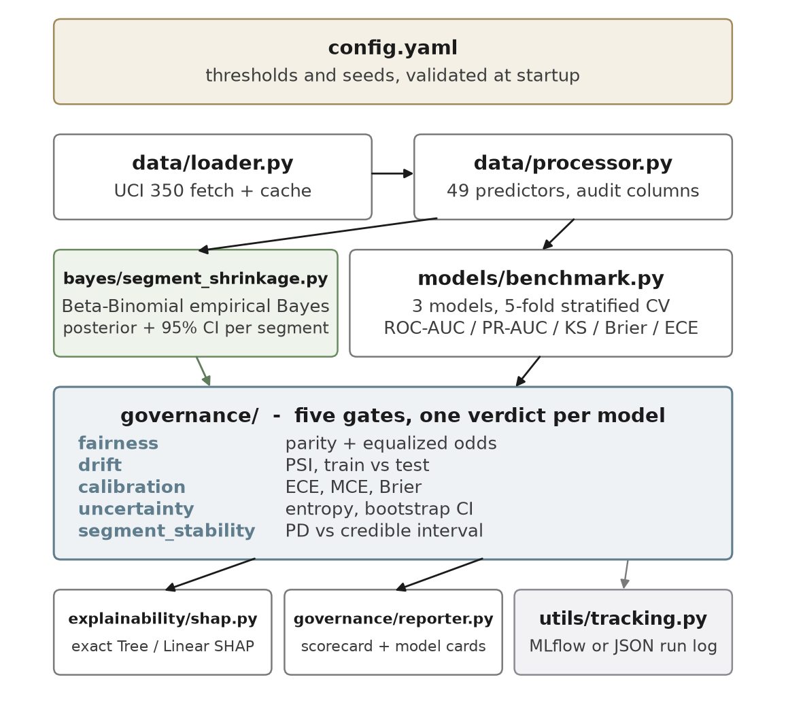

# Bayesian Credit Risk Gate

[](https://github.com/asynced24/bayesian-credit-risk-gate/actions/workflows/ci.yml)
[](LICENSE)
[](https://www.python.org/)

A model that predicts credit-card default isn't automatically safe to use. This
project trains three of them (logistic regression, XGBoost, LightGBM) on a public
dataset, then runs each one through five automated checks before deciding whether
it's actually deployable: is it fair across demographic groups, has the data drifted,
is it calibrated, is it overconfident, and does it handle small subgroups honestly?

Each check outputs pass, warn, or fail. Nothing is hand-waved — every number below
comes from actually running the code, and a full technical writeup with the math and
extra figures is at [`docs/whitepaper.pdf`](docs/whitepaper.pdf) if you want the
long version.

## Why bother with gates at all

A model can post a great AUC and still be a bad idea to ship. The usual place that
gets caught is a review meeting weeks after training, argued from a slide. Here it's
argued from a script that runs in 15 seconds and gives the same answer every time.

Two things came out of building this that were worth knowing before I ran it:

- **Small subgroups lie if you trust their raw rate.** A group of 17 people with one
  default has a "default rate" of 5.9%. That's not a real number, it's noise. The
  Bayesian layer pulls thin groups toward the overall population rate, by an amount
  that comes out of the math rather than a knob I turned.
- **Removing a column from the model doesn't remove its effect.** `sex` and
  `marriage` are never given to the model as inputs. The fairness gate still finds a
  real gap in how often the model catches actual defaulters, split by sex — because
  other columns carry enough of the same signal. The gate is there specifically to
  catch this, since "we didn't include the sensitive column" is not the same claim as
  "the model doesn't discriminate."

The sample run below ends in an overall **FAIL**. That's the point of building it —
a checklist that always says yes isn't checking anything.

## How it fits together



Data loads once, gets split and feature-engineered, then all three models are
benchmarked with 5-fold cross-validation. Every model goes through the same five
gates, gets a SHAP explanation, and lands in a scorecard plus a per-model report
card. Runs log to MLflow if it's around, or to a plain JSON file if not.

## The data

[UCI dataset 350, "Default of Credit Card Clients"](https://archive.ics.uci.edu/dataset/350/default+of+credit+card+clients)
— 30,000 real credit-card customers in Taiwan, six months of billing/repayment
history, and whether they defaulted on the next payment. About 1 in 5 did.

> Yeh, I. C., & Lien, C. H. (2009). *Expert Systems with Applications*, 36(2), 2473-2480.

Licensed CC BY 4.0. A 5,000-row stratified sample is committed to the repo
(`data/sample/uci_credit_sample.csv`) so the whole thing runs offline — no UCI
outage can break CI, and anyone cloning this can reproduce every number below
without an API key or a download. Regenerate it with `python main.py --refresh-sample`.

## Running it

Needs Python 3.12+ (a couple of the pinned dependencies require it).

```bash
git clone https://github.com/asynced24/bayesian-credit-risk-gate.git
cd bayesian-credit-risk-gate
pip install -r requirements.txt
python main.py --sample
```

That's the whole setup. No network call, no API key, no config file to edit first.
Takes about 15-20 seconds, mostly spent importing `shap` and `mlflow`. Reports land
in `reports/`.

```bash
python main.py                     # full 30,000-row dataset instead of the sample
python main.py --sample --no-shap  # skip the explainability step, faster
python main.py --models xgboost    # just one model
python main.py --mlflow            # log to MLflow instead of the local JSON file
python main.py --help
```

## What an actual run looks like

This is real output from `python main.py --sample` (seed 42, 3,750 train / 1,250 test rows):

| Model | ROC-AUC | Brier | Gate result |
|---|---|---|---|
| `xgboost` | 0.7672 | 0.1372 | FAIL |
| `lightgbm` | 0.7634 | 0.1374 | FAIL |
| `logistic_regression` | 0.7607 | 0.1403 | FAIL |

All three fail overall. Breaking that down by gate:

| Gate | `xgboost` | `lightgbm` | `logistic_regression` |
|---|---|---|---|
| fairness | FAIL | FAIL | FAIL |
| drift | PASS | PASS | PASS |
| calibration | WARN | WARN | WARN |
| uncertainty | PASS | PASS | PASS |
| segment stability | FAIL | FAIL | WARN |

The three models are within 0.007 ROC-AUC of each other, well inside the
fold-to-fold variance — so the leaderboard ranking isn't really meaningful here.
The gate matrix is the useful part of this table, not the top row.

### The fairness finding, briefly

Logistic regression never sees the `sex` column, and its predictions still show a
real gap: it correctly flags 41% of male defaulters but only 25% of female
defaulters (an "equalized odds" gap of 0.16, against a 0.10 limit). That's on the
5,000-row sample — the same check on the full 30,000 rows shrinks the gap to about a
sixth of that size and it passes, though a related check on age still fails. Same
direction, much smaller effect at scale, which is exactly the kind of thing you'd
expect from a number that started out close to its own margin of error.

The whitepaper walks through the actual confidence interval, checks the result at
different decision thresholds, and tests how recoverable `sex` is from the columns
the model *is* given. Worth reading if this result matters to you — the short
version above leaves out the uncertainty on purpose to stay readable.

### Cross-platform note

Run this on both Windows and Linux and `logistic_regression`/`lightgbm` come back
bit-for-bit identical. `xgboost` doesn't — its tree builder sums floating-point
values in a platform-dependent order, so its score moves by about 0.005 between the
two, which is enough to change which model "wins" the leaderboard depending on which
machine you're on. Every gate *verdict* is identical on both platforms regardless —
the pass/fail decision is stable even when the exact ranking isn't.

## The Bayesian part

Small groups of borrowers give unreliable default-rate estimates on their own. The
segment-stability gate fixes that by borrowing strength across similar groups: it
fits a population-level prior from all the groups big enough to trust, then blends
each individual group's rate toward that prior — more blending for small groups,
almost none for large ones. The blend weight isn't a setting anyone chose; it falls
out of how much data each group actually has.

On this dataset, groups are defined by education level crossed with age band (19
groups after folding a couple of undocumented codes into "other"). The fitted prior
works out to roughly a 22.3% population default rate, carrying about as much weight
as 398 real borrowers would. A group with only 6 people and zero recorded defaults
doesn't get treated as "0% risk" — it gets pulled to a posterior estimate around
22%, with an honest interval around it, because 6 data points aren't enough to
override the prior.

The stability gate then checks whether each model's predictions match this
"expected, given how much data we actually have" baseline. LightGBM fails it: it
systematically underprices default risk for one segment (graduate-educated
borrowers in their 30s) relative to what their real repayment history supports —
the kind of thing a plain accuracy number won't show you.

Two honest limitations, stated rather than skipped: the prior itself is fit from
only 12 of the 19 groups (the ones with enough data), and the intervals treat that
fitted prior as if it were known exactly, which understates the true uncertainty a
little. The full math, including that caveat, is in the whitepaper.

## Tech stack

| Area | Choice |
|---|---|
| Models | scikit-learn `LogisticRegression`, `xgboost`, `lightgbm` |
| Bayesian layer | numpy + scipy only, no extra dependency |
| Config | pydantic v2, validated at startup from `config.yaml` |
| Explainability | `shap` |
| Tracking | MLflow, with a local JSON fallback |
| Tests / lint | pytest / ruff |
| CI | GitHub Actions — lint, tests on 3.12 and 3.13, a full end-to-end smoke run |

One thing tried and deliberately left out: class rebalancing. Reweighting the
minority class barely moves ROC-AUC (and not consistently in one direction across
models) while wrecking calibration — predicted default rates roughly double across
the board. A probability of default that no longer means "probability of default"
isn't useful for anything downstream, so the models here are trained on the natural
class distribution.

## Project layout

```
.
├── main.py                      CLI entry point
├── config.yaml                  every gate threshold, validated at startup
├── data/
│   └── sample/                  the committed 5,000-row offline sample
├── financial_ai_framework/
│   ├── bayes/                   empirical-Bayes segment shrinkage
│   ├── data/                    UCI loading, caching, feature engineering
│   ├── models/                  the benchmark suite
│   ├── governance/              the five gates + report/scorecard generation
│   ├── explainability/          SHAP
│   └── utils/                   experiment tracking
├── tests/                       one module per component
└── .github/workflows/ci.yml     lint, test matrix, end-to-end smoke
```

## Testing

```bash
pip install -r requirements.txt -r requirements-dev.txt
pytest
ruff check .
```

Every gate is tested against both a known-bad and a known-good synthetic input, so a
gate that just always says "pass" would get caught. CI runs the full pipeline on the
committed sample on every push and checks that real output came out the other end —
not just that the script exited without crashing.

## Author

Aryan Singh — [github.com/asynced24](https://github.com/asynced24)

MIT licensed, see [LICENSE](LICENSE). The dataset sample carries its own CC BY 4.0
attribution in [NOTICE](NOTICE).
